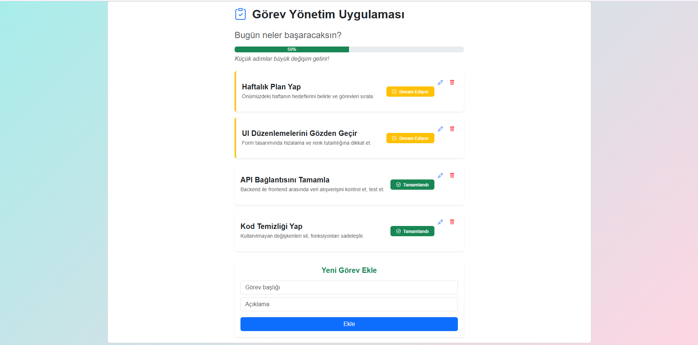

# 🗂️ Görev Yönetimi Uygulaması

## 🖼️ Ekran Görseli

---

Bu proje, kullanıcıların görevlerini yönetebileceği bir **Angular uygulamasıdır**.  
Görev ekleme, silme, güncelleme ve ilerleme durumlarını takip etme özellikleri içerir.

---

## 🔧 Teknolojiler

- **🖌️ Frontend:** Angular, TypeScript, HTML, CSS, Bootstrap  
- **💾 Backend:** Ayrı repository’de .NET Core + PostgreSQL kullanılmıştır.  

---

## ✨ Özellikler

- ✅ Görev ekleme, silme ve güncelleme  
- 📊 Görevlerin ilerleme durumunu görsel olarak takip edebilme  
- 📱 Mobil ve masaüstü uyumlu responsive tasarım  
