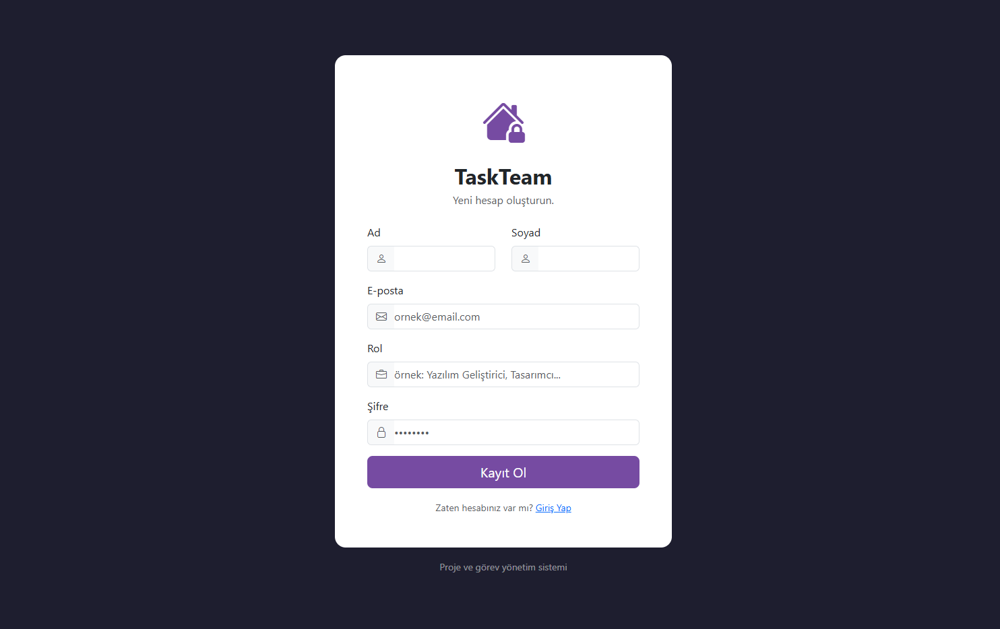

# 📘 TaskTeam
**Takımlar İçin Modern Görev & Proje Yönetim Sistemi**

---

## 🚀 Genel Tanıtım

**TaskTeam**, ekiplerin proje, görev ve personel yönetimini tek bir platform üzerinden kolayca yapabilmesi için geliştirilmiş tam entegre bir web uygulamasıdır.  

Uygulama, sadece yazılım ekipleriyle sınırlı değildir — **her türden çalışma grubunun** (örneğin tasarım, pazarlama, Ar-Ge veya ofis ekipleri)  
proje ve görev süreçlerini organize etmesini, ilerlemeyi takip etmesini ve ekip içi koordinasyonu artırmasını amaçlar.

Frontend kısmı **Angular**, backend kısmı **ASP.NET Core Web API**, veritabanı ise **PostgreSQL** teknolojileri kullanılarak geliştirilmiştir.  

TaskTeam, proje bazlı görev takibi, kullanıcı rolleriyle erişim yönetimi, güvenli kimlik doğrulama (JWT)  
ve dosya yükleme gibi temel yönetim özelliklerini bir araya getirir.

---

## 📸 Ekran Görüntüleri

### 🔐 Giriş ve Kayıt Ekranları

---

### 🧭 Dashboard

---

### 📋 Proje Listesi

---

### 🗂️ Görev Detay Sayfası

---

### 👥 Personel Yönetim Ekranı

---

### ⚙️ Yetki Bildirimi

---

## 🎯 Başlıca Özellikler

- 🔐 JWT tabanlı kimlik doğrulama (login, register)  
- 👥 Rol bazlı yetkilendirme:  
  - Admin → Personel görüntüleme, proje/görev silme  
  - User → Proje/görev ekleme, düzenleme ve görüntüleme  
- 🧱 Proje & görev yönetimi (oluşturma, düzenleme, silme)  
- 👨‍💼 Personel listesi (sadece Admin erişimi)  
- 📂 Dosya yükleme API’si (.NET)  
- 🗃️ PostgreSQL fonksiyonlarıyla işlem kolaylığı  
- 🧭 Modern, responsive Angular arayüzü  

---

## 🖥️ Frontend Detayları

- Angular ile SPA (Single Page Application) mimarisi  
- Responsive tasarım ile farklı cihaz uyumluluğu  
- Kullanıcı dostu form validasyonu ve hata mesajları  

---

## ⚙️ Backend & API Detayları

Backend, **ASP.NET Core Web API** ile geliştirilmiştir ve JWT tabanlı güvenlik ile rol bazlı yetkilendirme sunar.  
API’ler, CRUD işlemleri, dosya yükleme ve kullanıcı yönetimi gibi temel işlevleri sağlar.  

### 🔐 Kimlik Doğrulama
- **POST /api/Auth/login** → Kullanıcı giriş işlemi  
- **POST /api/Auth/register** → Yeni kullanıcı kaydı  

### 👥 Personel Yönetimi (Admin yetkisi gerekli)
- **GET /api/Personel** → Tüm personeli listele  
- **POST /api/Personel** → Yeni personel ekle  
- **PUT /api/Personel/{id}** → Personel bilgilerini güncelle  
- **DELETE /api/Personel/{id}** → Personeli sil  

### 🏗️ Proje Yönetimi
- **GET /api/Project** → Tüm projeleri listele  
- **POST /api/Project** → Yeni proje ekle  
- **PUT /api/Project/{id}** → Proje güncelle  
- **DELETE /api/Project/{id}** → Proje sil  

### 📝 Görev (Task) Yönetimi
- **GET /api/Task/project/{projectId}** → Belirli bir projeye ait görevleri listele  
- **GET /api/Task/personnel/{personnelId}** → Belirli bir personele atanmış görevleri listele  
- **POST /api/Task** → Yeni görev ekle  
- **PUT /api/Task/{id}** → Görev güncelle  
- **DELETE /api/Task/{id}** → Görev sil  

### 📂 Dosya Yükleme (Upload)
- **POST /api/Upload** → Dosya yükle  
- **GET /api/Upload** → Tüm dosyaları listele  
- **GET /api/Upload/{fileName}** → Belirli bir dosyayı indir  
- **DELETE /api/Upload/{fileName}** → Dosya sil  

> Tüm API endpointleri **JWT ile korunur** ve yalnızca yetkili kullanıcılar tarafından erişilebilir.  

---

## 🛠️ Kullanılan Teknolojiler

- **Frontend:** Angular, Bootstrap, HTML5, CSS3  
- **Backend:** ASP.NET Core Web API, C#  
- **Veritabanı:** PostgreSQL  
- **Authentication:** JWT  

---

## ⚡ Notlar

- Personel görüntüleme ve silme işlemleri sadece **Admin rolü** ile yapılabilir.  
- Dosya yükleme backend’de mevcut, frontend’de henüz gösterilmiyor; ileride arayüzü eklenecek.  
- WebSocket ile gerçek zamanlı bildirim sistemi planlanıyor (örneğin yeni görev, harcama veya anket eklenince anında bildirim).

